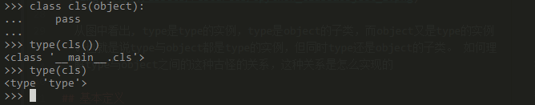
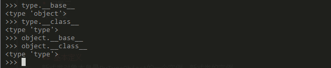



本篇将大概分析cpython中类对象与实例对象的创建过程，其中新式类与经典类在cpython层面是不同的实现，对于经典类仅仅指出其代码位置不做分析。

<hr />

我们仍然使用问题牵引的方法来展开我们的分析。

* 问题一
从python层面观察，用户自定义类是type的实例，而type的实例是类型，然而用户自定义的类的实例通常情况却不是类型，type、用户自定义类型、类型实例不都是对象吗，之间为什么会有这种区别？对象的区别仅仅在于属性与方法的区别而已才对，那么这些对象的不同是单纯的因为属性与方法不同吗？

 

* 问题二
 

  从图中看出, type是type的实例，type是object的子类，而object又是type的实例。也就是说type与object都是type的实例，但同时type还是object的子类。 如何理解type与object之间的这种古怪的关系，这种关系是怎么实现的

* 问题三
  指定元类与类继承的情况下用户自定义类是怎么创建的

* 问题四
  用户自定义类是怎么创建实例的
* 问题五
  内建类与内建函数按照python的世界观也应该是对象，他们又是怎么创建的

<hr />
下面我们将通过跟踪调试代码的方式来一一探求这些问题。


<hr/>
下面为以上探求的一个总结

## 基本定义
新式类对象本身是PyTypeObject的一个实例，新式类的实例

## 内建类

## 用户自定义类型

## 用户自定义类型实例

## 元类

build_class函数

与PyClass_Type中的class_new的关系


当解释器遇到class关键字定义的class之后，build_class()函数开始执行。
build_class主要是寻找一个合适的metaclass，如果类定义中没有指定metaclass的话，一般是
类定义中所有基类中的第一个。
然后将解析类定义所得的所有参数传给这个metaclass，也就是执行它。而我们知道，这个metaclass必然
是已经被解析类定义的时候解析成了一个PyObject，而执行一个PyObject，也就是调用PyObject_Call
相当于调用PyObject->tp_type->tp_call.

假设有如下的类继承关系:
object <- ClassA <- ClassB <- ClassC

当build_class构建ClassC的时候，相当于执行ClassB(args***)，
```
result = PyObject_CallFunctionObjArgs(ClassB, name, bases, methods,
                                      NULL);
```
而执行ClassB，别忘了ClassB也是一个PyObject，执行相当于type(ClassB)->tp_call。而Class的B的type就是type。

```
   type->tp_call(ClassB, name, bases, methods )

```
